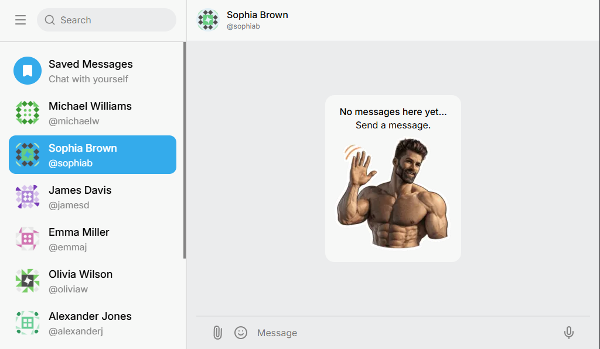

# 🚀 GigaChat Messenger (Telegram Clone)

_Live Demo:_ https://react-ts-practice-pearl.vercel.app/



## ✨ Features

- **Real-time Chat**: Real-time messaging via WebSockets using the Optimistic UI pattern (messages appear instantly before the server responds).
- **Advanced Authentication**: Seamless JWT token updates (Refresh Token) using the "Promise Mutex" pattern to prevent race conditions during requests.
- **Smart Interface**:
  - Auto-expanding input field (textarea) for typing long messages.
  - Smart scrolling to the latest message.
  - Debounced search (with delay).
- **Sidebar**: Convenient navigation between the chat list, search, and user profile.
- **Accessibility (A11y)**: Semantic markup of buttons and fields using ARIA attributes.

## 🛠 Technologies

**Core:**

- [React 18](https://react.dev/) — UI library.
- [TypeScript](https://www.typescriptlang.org/) — Strict typing and error protection.
- [Vite](https://vitejs.dev/) — Ultra-fast project bundler.

**State Management & Routing:**

- [@tanstack/react-query](https://tanstack.com/query/latest) — Request caching, optimistic updates, and server state management.
- [@tanstack/react-router](https://tanstack.com/router/latest) — Next-generation type-safe routing.
- [Zustand](https://zustand-demo.pmnd.rs/) — Lightweight global UI state management (opening chats, menus).

**Networking:**

- [Axios](https://axios-http.com/) — HTTP client with configured interceptors.
- [WebSockets](https://developer.mozilla.org/en-US/docs/Web/API/WebSocket) — Two-way communication with the server.
- [js-cookie](https://github.com/js-cookie/js-cookie) — Secure token handling.

**Styling:**

- [Tailwind CSS](https://tailwindcss.com/) — Utility-first CSS framework.
- [Lucide React](https://lucide.dev/) — Beautiful and lightweight SVG icons.

## 🚀 Local Setup Instructions

### Prerequisites

Ensure you have [Node.js](https://nodejs.org/) (version 18 or higher) and a package manager like `npm` or `bun` installed.

### Installation Steps

1. **Clone the repository:**

   ```bash
   git clone https://github.com/mykytakorotych-web/react-ts-practice.git
   cd react-ts-practice
   ```

2. **Install dependencies:**

   ```bash
   bun install
   # or
   npm install
   ```

3. **Start the development server:**

   ```bash
   bun run dev
   # or
   npm run dev
   ```

4. **Open the application:**
   Navigate to http://localhost:5173 in your browser (or another port specified by Vite in the terminal).

## 📝 Demo Credentials

To test the authentication flow, you can use the following DummyJSON test user:

- **Username**: emilys

- **Password**: emilyspass
